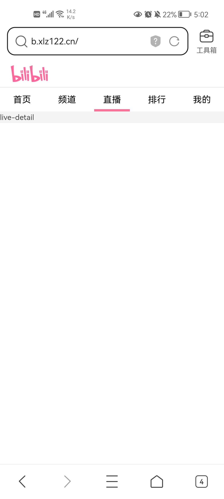
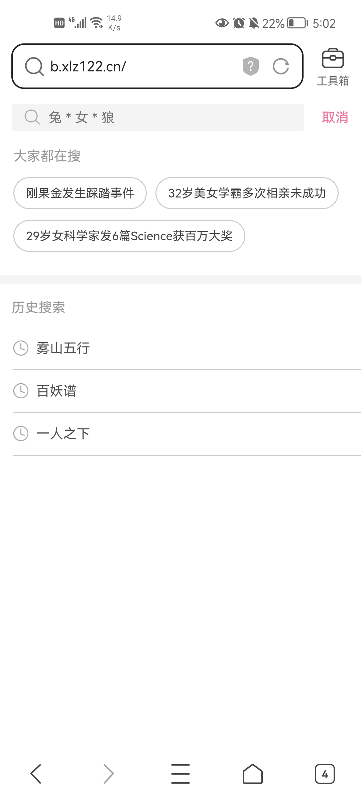

# 哔哩哔哩

**特别声明：本项目中的展示图片归哔哩哔哩所有。如果侵权，请提交 Issues 联系。**

## 环境要求

需要 NodeJS 16.8.0+ 环境


## 简介

本项目是一个仿写哔哩哔哩H5移动端项目

接口及接口文档请查看[bilibili-api](https://github.com/xlz122/bilibili-api)

## 项目使用技术栈

* React全家桶
* Next
* Redux
* TypeScript

## 加入项目

如果想加入本项目开发，需将项目fork到自己的仓库下，功能开发完成后，提PR即可

## 运行

启动项目

```
yarn install
```

```
yarn dev
```

项目打包

```
yarn build
```

## 项目效果图

|首页|直播|排行榜|我的|
|---|---|---|---|
|||||

|视频详情|搜索|搜索建议|搜索详情|
|---|---|---|---|
|||||


## 写在最后

* 本项目仅用于学习使用，切勿用于商业用途，否则产生的法律后果与作者无关。
