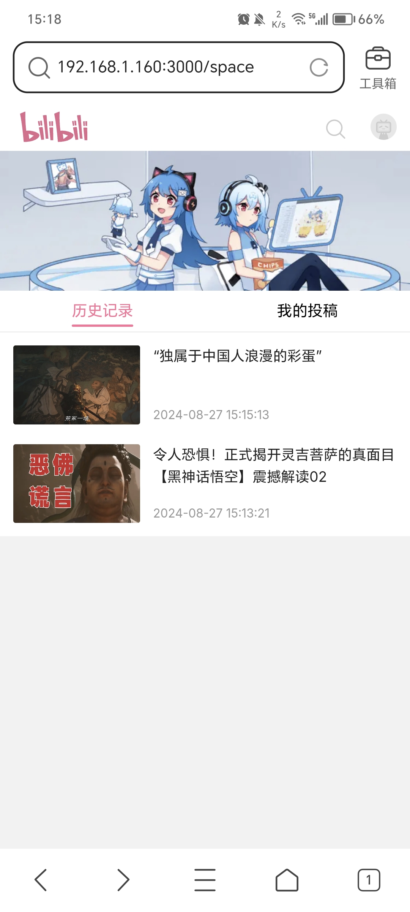
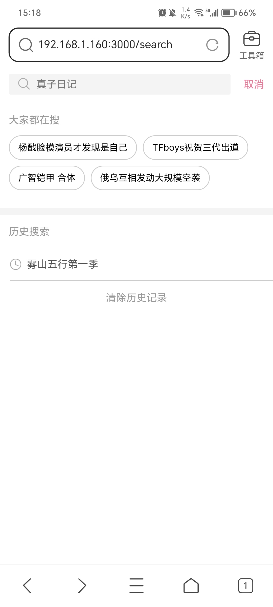
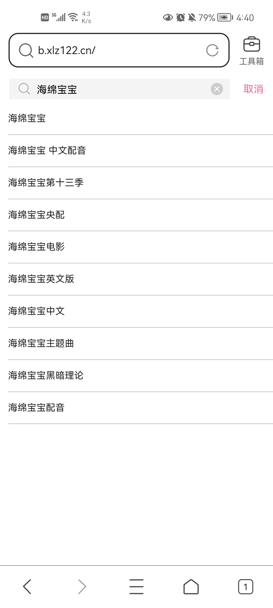

## 环境要求

需要 NodeJS 20.11.0+ 环境

## 简介

master分支使用App Router进行重构, Pages Router可查看 [pages-router](https://github.com/xlz122/bilibili/tree/pages-router) 分支

项目接口及接口文档请查看 [bilibili-server](https://github.com/xlz122/bilibili-server)

## 项目使用技术栈

* React
* Next 15.4.3
* Redux
* TypeScript

## 加入项目

如果想加入本项目开发，需将项目fork到自己的仓库下，功能开发完成后，提PR即可。

## 运行

启动项目

```
yarn install
```

```
yarn dev
```

项目打包

```
yarn build
```

## 项目效果图

|首页|直播|排行榜|我的|
|---|---|---|---|
|||||

|搜索|搜索建议|搜索详情|视频详情|
|---|---|---|---|
|||||

## 写在最后

* [The MIT License (MIT)](https://github.com/xlz122/bilibili/blob/master/LICENSE)
* 本项目仅用于学习使用，切勿用于商业用途，否则产生的法律后果与作者无关。
